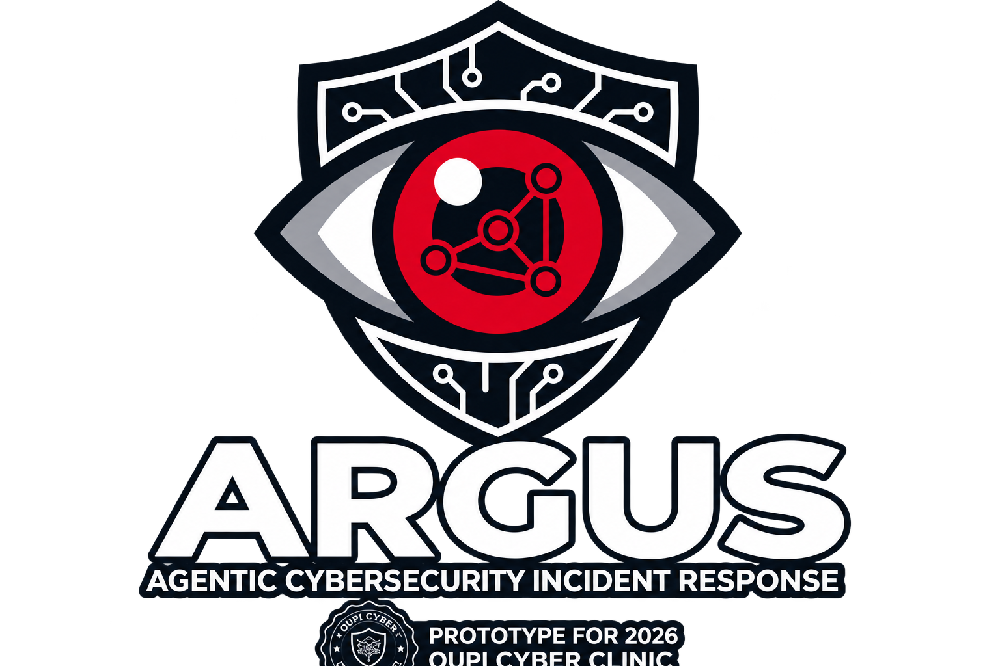
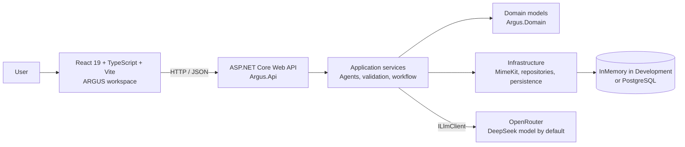
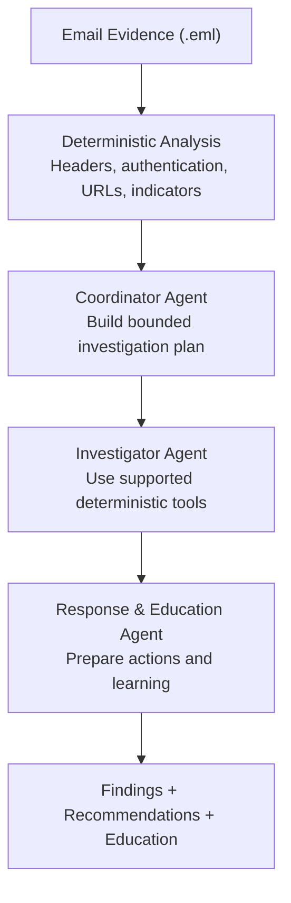
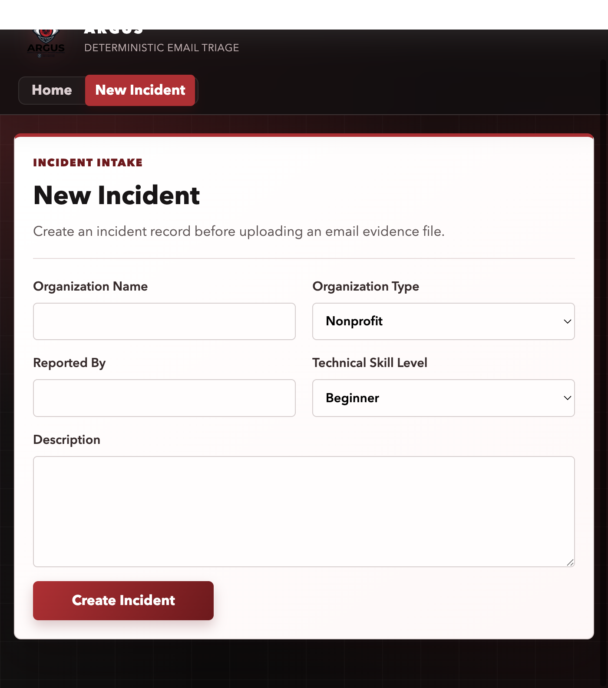

<p align="center">
  
</p>

<h1 align="center">ARGUS</h1>

<p align="center"><strong>AI Cyber Incident Clinic</strong></p>

<p align="center">
  Analyze suspicious email.<br>
  Investigate the evidence.<br>
  Respond with confidence. Learn from the incident.
</p>

<p align="center">
  <a href="https://dotnet.microsoft.com/"></a>
  <a href="https://learn.microsoft.com/aspnet/core/"></a>
  <a href="https://react.dev/"></a>
  <a href="https://www.typescriptlang.org/"></a>
  <a href="https://vite.dev/"></a>
  <a href="https://www.postgresql.org/"></a>
  <a href="https://openrouter.ai/"></a>
  <a href="https://attack.mitre.org/"></a>
</p>

<p align="center">
  <a href="#quick-start"></a>
  <a href="#architecture"></a>
  <a href="#screenshots"></a>
  <a href="#safety-model"></a>
  <a href="https://github.com/Jojo174code/ARGUS/issues"></a>
</p>

ARGUS is an AI-assisted cyber incident clinic for small organizations, nonprofits, churches, schools, small businesses, and cyber clinics without a dedicated SOC. It analyzes suspicious email evidence, coordinates a bounded investigation, produces evidence-grounded findings and response recommendations, and teaches users how to recognize similar threats.

> [!IMPORTANT]
> ARGUS supports investigation and learning. It is experimental software and does not replace professional incident response.

## Contents

- [Overview](#overview)
- [Features](#key-features)
- [Architecture](#architecture)
- [How ARGUS Works](#how-argus-works)
- [Screenshots](#screenshots)
- [Quick Start](#quick-start)
- [Configuration](#configuration)
- [Using ARGUS](#using-argus)
- [Safety Model](#safety-model)
- [Testing](#testing)
- [API Overview](#api-overview)
- [Project Status](#project-status)

## Overview

Small organizations often need to investigate phishing reports without security analysts on staff. ARGUS combines deterministic email analysis with bounded AI agents in a guided, reviewable workflow. It does not autonomously perform destructive remediation.

## Key Features

- Secure `.eml` evidence upload with SHA-256 integrity fingerprints
- Deterministic phishing analysis with explainable risk scoring
- Email authentication analysis and URL inspection
- MITRE ATT&CK mapping and an Evidence -> Findings -> Actions incident map
- Coordinator Agent, Investigator Agent, and Response & Education Agent
- Evidence-grounded findings and human-in-the-loop response recommendations
- Incident-specific cybersecurity education, knowledge checks, and plain-language assistance
- Guided workflow UI, persisted progress tracking, and visual results dashboard
- Prompt-injection-resistant handling, structured model outputs, and persisted investigation state

## Architecture



The frontend uses the API at `http://localhost:5056` by default. The API uses InMemory storage in Development and supports PostgreSQL for relational deployments. OpenRouter is accessed through the `ILlmClient` provider boundary.

## How ARGUS Works



Deterministic analysis happens before AI. AI agents operate within distinct, bounded responsibilities and consume structured evidence and prior persisted output.

## Screenshots

### Incident Intake

The New Incident screen captures organization and reporter context before evidence upload.



## Quick Start

### 1. Clone

```bash
git clone https://github.com/Jojo174code/ARGUS.git
cd ARGUS
```

### 2. Create local environment settings

macOS/Linux:

```bash
cp .env.example .env
```

Windows PowerShell:

```powershell
Copy-Item .env.example .env
```

Edit `.env` with your OpenRouter credential. Do not commit this file.

```dotenv
OPENROUTER_API_KEY=your-openrouter-key
OPENROUTER_MODEL=deepseek/deepseek-v4-pro-0813
OPENROUTER_BASE_URL=https://openrouter.ai/api/v1
OPENROUTER_SITE_URL=http://localhost
OPENROUTER_APP_NAME=ARGUS
OPENROUTER_TIMEOUT_SECONDS=120
OPENROUTER_MAX_RETRIES=2
```

### 3. Run the API

```bash
dotnet restore
dotnet run --project src/Argus.Api
```

The Development API runs at `http://localhost:5056`. Development uses an InMemory database by default, so PostgreSQL is not required for a first run.

### 4. Run the frontend

In another terminal:

```bash
cd src/argus-web
npm install
npm run dev -- --host localhost --port 5173
```

Open `http://localhost:5173`.

## Verify OpenRouter

When the API is running in Development, use the diagnostic endpoint to verify the configured provider and authentication without exposing the key:

```bash
curl -sS http://localhost:5056/api/development/openrouter/status
```

Expected response shape:

```json
{
  "provider": "OpenRouter",
  "model": "deepseek/deepseek-v4-pro-0813",
  "authenticationSucceeded": true,
  "httpStatus": 200,
  "error": null
}
```

This endpoint is Development-only. Never paste an API key into source, logs, or issue reports.

## Configuration

| Variable | Required | Default | Purpose |
| --- | --- | --- | --- |
| `OPENROUTER_API_KEY` | Yes | None | OpenRouter API credential |
| `OPENROUTER_MODEL` | No | `deepseek/deepseek-v4-pro-0813` | OpenRouter model identifier |
| `OPENROUTER_BASE_URL` | No | `https://openrouter.ai/api/v1` | OpenRouter API base URL |
| `OPENROUTER_SITE_URL` | No | None | Optional OpenRouter HTTP-Referer value |
| `OPENROUTER_APP_NAME` | No | `ARGUS` | OpenRouter application title |
| `OPENROUTER_TIMEOUT_SECONDS` | No | `120` | HTTP timeout, from 10 to 300 seconds |
| `OPENROUTER_MAX_RETRIES` | No | `2` | Transient retry count, from 0 to 3 |
| `VITE_API_BASE_URL` | No | `http://localhost:5056` | Frontend API base URL |

Environment variables take precedence over application configuration. Restart the API after changing `.env`.

## Using ARGUS

1. **New Incident**: create a case with organization and reporter context.
2. **Evidence**: upload the suspicious email as `.eml` evidence. The maximum upload size is 2 MB.
3. **Guide**: run individual stages or the Full Workflow.
4. **Results**: use **What ARGUS Found** to review risk, confidence, findings, and recommendations.
5. **Learn**: review incident-specific education, warning signs, knowledge checks, and the plain-language assistant.

## AI Workflow

### Coordinator Agent

Builds a bounded investigation plan and identifies missing information.

### Investigator Agent

Executes supported deterministic investigation tools and synthesizes evidence-grounded findings.

### Response & Education Agent

Produces prioritized recommendations and incident-specific learning material. Security-changing recommendations require human approval.

### Investigation Tools

The Investigator Agent uses these registered deterministic tools:

- Email Metadata
- Email Authentication
- URL Inspection
- MITRE Mapping

## Safety Model

- ARGUS does not execute email attachments or automatically visit suspicious URLs.
- ARGUS does not change passwords, block accounts, or autonomously remediate production systems.
- Evidence references are validated; unknown evidence references are rejected.
- Prompt injection inside email content is treated as hostile evidence, not instructions.
- Structured model outputs and deterministic analysis precede AI-assisted conclusions.
- Review recommendations before taking security-changing action.

## Testing

Run all backend tests from the repository root:

```bash
dotnet test
```

Run the frontend tests and production build:

```bash
cd src/argus-web
npm test
npm run build
```

Run deterministic evaluations:

```bash
dotnet test tests/Argus.EvaluationTests/Argus.EvaluationTests.csproj
```

Evaluation output is generated under `artifacts/evaluation/` and ignored by Git. It uses deterministic fake providers and is not a live-AI performance claim.

## API Overview

| Method | Route | Purpose |
| --- | --- | --- |
| `POST` | `/api/incidents` | Create an incident |
| `GET` | `/api/incidents/{id}` | Get an incident |
| `POST` | `/api/incidents/{id}/evidence/email` | Upload email evidence |
| `POST` | `/api/incidents/{id}/analyze` | Run deterministic analysis |
| `POST` | `/api/incidents/{id}/coordinator/plan` | Run the Coordinator Agent |
| `POST` | `/api/incidents/{id}/investigator/run` | Run the Investigator Agent |
| `POST` | `/api/incidents/{id}/response/generate` | Run Response & Education |
| `POST` | `/api/incidents/{id}/workflow/run` | Run the unified workflow |
| `GET` | `/api/incidents/{id}/workflow` | Get persisted workflow progress |

Swagger is available in Development at `http://localhost:5056/swagger`.

## Project Structure

```text
ARGUS/
├── src/
│   ├── Argus.Api/            # API host and controllers
│   ├── Argus.Application/    # services, agents, validation, investigation tools
│   ├── Argus.Domain/         # domain models
│   ├── Argus.Infrastructure/ # persistence, MimeKit, OpenRouter, migrations
│   └── argus-web/            # React frontend
├── tests/                    # unit, integration, and evaluation tests
├── docs/screenshots/         # current UI screenshots used by this README
└── .env.example              # safe local configuration template
```

## Troubleshooting

### OpenRouter authentication failure

- Verify `OPENROUTER_API_KEY` in `.env`.
- Restart the API after editing `.env`.
- Check the Development-only OpenRouter status endpoint.
- Check for stale shell environment variables, which take precedence over `.env`.

### Address already in use

On macOS/Linux:

```bash
lsof -i :5056
```

Stop the stale process and run the API again.

### Frontend cannot reach the API

- Confirm the API is running at `http://localhost:5056`.
- Confirm Vite is running at `http://localhost:5173`.
- Check `VITE_API_BASE_URL` when using a non-default API address.
- The default CORS configuration permits `http://localhost:5173`.

## License

No license file is currently included. Do not assume reuse rights without permission from the repository owner.

## Project Status

ARGUS is an actively developed cybersecurity research and competition project. Treat it as experimental software, not as a production replacement for professional incident response.
